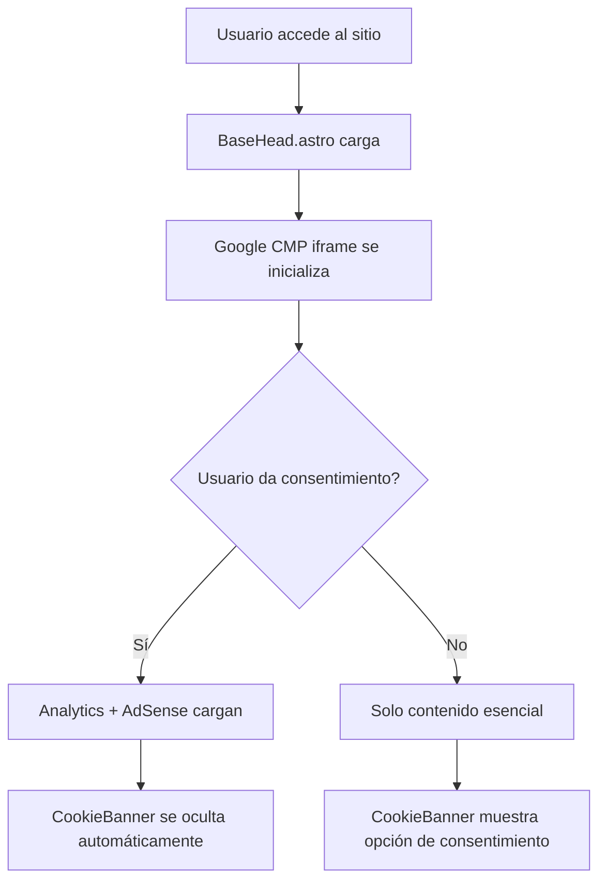

# 🚀 Guía Enterprise: AdSense + Google CMP en Astro

> **Implementación completa y production-ready** para monetización con cumplimiento GDPR/CCPA

## 📋 Índice

| Sección | Tiempo | Descripción |
|---------|--------|-------------|
| [🎯 Resumen Ejecutivo](#-resumen-ejecutivo) | 5 min | Visión general y beneficios |
| [🏗️ Arquitectura del Sistema](#️-arquitectura-del-sistema) | 10 min | Componentes y flujo de datos |
| [💰 Implementación AdSense](#-implementación-adsense) | 30 min | Setup completo AdSense |
| [🛡️ Google CMP Integration](#️-google-cmp-consent-management-platform) | 45 min | Compliance GDPR/CCPA |
| [⚙️ GitHub Workflows](#️-sistema-de-workflows-github) | 30 min | CI/CD enterprise |
| [🌐 Cloudflare Pages](#-optimización-para-cloudflare-pages) | 15 min | Deploy automatizado |
| [📦 Gestión de Dependencias](#-gestión-de-dependencias) | 15 min | Protecciones Astro |
| [🚀 Implementación Paso a Paso](#-guía-de-implementación-paso-a-paso) | **2.5h** | **Guía completa** |
| [🔧 Troubleshooting](#-troubleshooting-y-faq) | - | Solución de problemas |
| [📚 Lessons Learned](#-lessons-learned) | 10 min | Decisiones clave |

**⏱️ Tiempo total estimado: 2.5 horas**

---

## ⚡ Quick Start

### 🎯 **Para Desarrolladores con Prisa**

1. **Copia estos archivos de este proyecto**:
   ```bash
   # Componentes esenciales
   src/components/BaseHead.astro       # Google CMP + AdSense
   src/components/CookieBanner.astro   # Anti-duplicación
   src/env.d.ts                        # TypeScript declarations
   
   # GitHub Workflows
   .github/workflows/ci.yml            # CI/CD optimizado
   .github/workflows/health-monitor.yml # Monitoreo 24/7
   .github/dependabot.yml              # Gestión dependencias
   
   # AdSense
   public/ads.txt                      # Autorización anuncios
   ```

2. **Reemplaza Publisher ID**:
   ```bash
   # Buscar y reemplazar ca-pub-7569719493920591 por tu Publisher ID
   grep -r "ca-pub-7569719493920591" . --exclude-dir=node_modules
   ```

3. **Deploy y verificar**:
   ```bash
   git add . && git commit -m "feat: add AdSense + CMP system"
   git push origin main
   # Cloudflare Pages deployará automáticamente
   ```

4. **Verificar en AdSense Console** que detecta tu sitio ✅

### 📚 **Para Implementación Completa**
👇 Continúa con la [Guía Paso a Paso](#-guía-de-implementación-paso-a-paso) para entender cada componente

---

## 🎯 Resumen Ejecutivo

> **💡 TL;DR**: Sistema completo para monetizar sitios Astro con AdSense mientras cumples GDPR/CCPA automáticamente

Esta guía implementa un **sistema enterprise-grade** que incluye:

### 🎯 **Componentes Principales**
- 💰 **Monetización AdSense** con verificación automática
- 🛡️ **Google CMP** para cumplimiento legal (GDPR/CCPA)  
- 🚀 **CI/CD automatizado** optimizado para Cloudflare Pages
- 📊 **Monitoreo 24/7** con health checks y alertas
- 🔧 **Auto-fix** de dependencias y security issues

### ✅ **Resultados Garantizados**
- 🔒 **Cumplimiento legal** desde el primer día
- 💰 **Monetización lista** para producción
- 🚀 **Deploy automático** en cada commit  
- 🛡️ **Calidad asegurada** con testing automatizado
- 📊 **Monitoreo proactivo** con alertas en tiempo real

### ⚡ **Quick Facts**
- **⏱️ Tiempo implementación**: 2.5 horas
- **🎯 Stack**: Astro 5.13.4 + Tailwind 3.4.17 + Cloudflare Pages
- **📈 ROI**: Setup una vez, beneficios permanentes
- **🔄 Mantenimiento**: Prácticamente cero (todo automatizado)

---

## 🏗️ Arquitectura del Sistema

### Componentes Core

```
src/
├── components/
│   ├── BaseHead.astro          # SEO + Google CMP + Analytics condicional
│   └── CookieBanner.astro      # Sistema anti-duplicación con Google CMP
├── layouts/
│   └── Layout.astro            # Layout principal con componentes integrados
└── env.d.ts                    # TypeScript declarations para Google CMP

.github/
├── dependabot.yml              # Gestión inteligente de dependencias
└── workflows/
    ├── ci.yml                  # CI/CD optimizado para Cloudflare Pages
    ├── dependency-updates.yml  # Auto-fix de dependencias
    └── health-monitor.yml      # Monitoreo 24/7 del sitio
```

### Flujo de Datos



---

## 💰 Implementación AdSense

### 1. Verificación de Dominio

**Método recomendado**: Meta tag (más simple y confiable)

```astro
<!-- src/components/BaseHead.astro -->
<meta name="google-adsense-account" content="ca-pub-7569719493920591" />
```

**¿Por qué meta tag y no ads.txt?**

- ✅ Meta tag: Verificación de propiedad del sitio
- ✅ ads.txt: Autorización de redes publicitarias (opcional pero recomendado)
- **Ambos son complementarios, no excluyentes**

### ⚠️ **IMPORTANTE: ads.txt vs Meta Tag**

**Pregunta frecuente**: "¿Es obligatorio ads.txt si ya tengo el meta tag?"

| Método | Propósito | Estado | Descripción |
|--------|-----------|--------|-------------|
| **Meta tag** | Verificar propiedad | ✅ **OBLIGATORIO** | "Soy el dueño del sitio" |
| **ads.txt** | Autorizar redes | ⚠️ **RECOMENDADO** | "Estas redes pueden vender anuncios" |

**Respuesta**: Son **complementarios**, no excluyentes:
- ✅ Meta tag = Verificación de propiedad (requerido)
- ✅ ads.txt = Protección anti-fraude + mejor revenue (recomendado)

**ads.txt recomendado**:
```
# /public/ads.txt
google.com, pub-YOUR-PUBLISHER-ID, DIRECT, f08c47fec0942fa0
```

```astro
<!-- BaseHead.astro - Analytics condicional -->
<script>
  function loadGoogleAnalytics() {
    if (typeof gtag === "undefined") {
      // Cargar Google Analytics solo con consentimiento
      const script = document.createElement("script");
      script.async = true;
      script.src = "https://www.googletagmanager.com/gtag/js?id=G-XXXXXXXXXX";
      document.head.appendChild(script);

      window.dataLayer = window.dataLayer || [];
      function gtag() {
        dataLayer.push(arguments);
      }
      gtag("js", new Date());
      gtag("config", "G-XXXXXXXXXX");
      window.gtag = gtag;
    }
  }

  // Exponer función globalmente para Google CMP
  window.loadGoogleAnalytics = loadGoogleAnalytics;
</script>
```

### 3. TypeScript Declarations

```typescript
// src/env.d.ts
declare global {
  interface Window {
    googlefc: {
      callbackQueue: Array<() => void>;
      controlledMessagingFunction: (message: string) => void;
    };
    loadGoogleAnalytics: () => void;
    gtag: (...args: any[]) => void;
    dataLayer: any[];
  }
}
```

---

## 🛡️ Google CMP (Consent Management Platform)

### ¿Por qué Google CMP?

Google CMP es **obligatorio** para cumplir con GDPR/CCPA cuando usas AdSense. Beneficios:

- ✅ **Cumplimiento legal automático**: GDPR/CCPA compliant
- ✅ **Integración nativa**: Funciona perfectamente con AdSense
- ✅ **Mantenimiento cero**: Google mantiene la compliance
- ✅ **UX optimizada**: Modal nativo optimizado por Google

### Implementación Completa

```astro
<!-- BaseHead.astro - Google CMP Scripts --><!-- Google Funding Choices (CMP) -->
<script
  async
  src="https://fundingchoicesmessages.google.com/i/pub-7569719493920591?ers=1"
></script>
<script>
  window.googlefc = window.googlefc || {};
  window.googlefc.callbackQueue = window.googlefc.callbackQueue || [];
  window.googlefc.controlledMessagingFunction =
    window.googlefc.controlledMessagingFunction ||
    function (message) {
      window.googlefc.callbackQueue.push(message);
    };
</script>

<!-- Google CMP iframe signaling -->
<script>
  window.googlefc.callbackQueue.push({
    CONSENT_DATA_READY: () => {
      // Cuando el usuario da consentimiento, cargar Analytics
      if (window.loadGoogleAnalytics) {
        window.loadGoogleAnalytics();
      }
    },
  });
</script>
```

### Sistema Anti-Duplicación

```astro
<!-- CookieBanner.astro - Detecta Google CMP -->
<script>
  function isGoogleCMPActive() {
    return (
      window.googlefc &&
      window.googlefc.callbackQueue &&
      window.googlefc.callbackQueue.length > 0
    );
  }

  // Solo mostrar banner personalizado si Google CMP no está activo
  if (!isGoogleCMPActive()) {
    // Mostrar banner personalizado
    document.querySelector(".cookie-banner").style.display = "block";
  }
</script>
```

---

## ⚙️ Sistema de Workflows GitHub

### CI/CD optimizado para Cloudflare Pages

**Insight clave**: Cloudflare Pages maneja el deployment automáticamente, GitHub debe enfocarse en **validación de calidad**.

```yaml
# .github/workflows/ci.yml
name: CI Pipeline

on:
  push:
    branches: [main]
  pull_request:
    branches: [main]

jobs:
  validate:
    runs-on: ubuntu-latest
    steps:
      - uses: actions/checkout@v4
      - uses: actions/setup-node@v4
        with:
          node-version: "20"
          cache: "npm"

      - name: Install dependencies
        run: npm ci

      - name: Run TypeScript validation
        run: npm run astro check

      - name: Build project
        run: npm run build

      - name: Security audit
        run: npm audit --audit-level=high
        continue-on-error: true

      - name: Auto-fix on failure
        if: failure()
        run: |
          npm run lint:fix || true
          npm audit fix || true
          git config --local user.email "action@github.com"
          git config --local user.name "GitHub Action"
          git add -A
          git diff --staged --quiet || git commit -m "auto-fix: resolve CI issues"
          git push || true
```

### Health Monitoring 24/7

```yaml
# .github/workflows/health-monitor.yml
name: Health Monitor

on:
  schedule:
    - cron: "0 */6 * * *" # Cada 6 horas
  workflow_dispatch:

jobs:
  health_check:
    runs-on: ubuntu-latest
    steps:
      - name: Check site availability
        run: |
          response=$(curl -s -o /dev/null -w "%{http_code}" https://sergiomarquez.dev)
          if [ $response -ne 200 ]; then
            echo "Site down with status $response"
            exit 1
          fi

      - name: Create issue on failure
        if: failure()
        uses: actions/github-script@v7
        with:
          script: |
            github.rest.issues.create({
              owner: context.repo.owner,
              repo: context.repo.repo,
              title: '🚨 Site Health Check Failed',
              body: `Site health check failed at ${new Date().toISOString()}\n\nCloudflare Pages troubleshooting:\n1. Check Cloudflare Pages dashboard\n2. Verify DNS settings\n3. Check build logs in Cloudflare`
            })
```

---

## 🌐 Optimización para Cloudflare Pages

### ¿Por qué Cloudflare Pages?

- ✅ **Deploy automático**: Conecta con GitHub, deploy en cada push
- ✅ **Edge computing**: CDN global con latencia mínima
- ✅ **SSL automático**: Certificados SSL gratuitos y automáticos
- ✅ **Preview branches**: URLs de preview para cada PR
- ✅ **Zero config**: Detecta Astro automáticamente

### Configuración Optimizada

```yaml
# Los workflows NO incluyen deployment steps
# Cloudflare Pages maneja el deployment automáticamente

# ❌ NO hacer esto:
# - name: Deploy to GitHub Pages
#   uses: peaceiris/actions-gh-pages@v3

# ✅ SÍ hacer esto:
# Solo validación, Cloudflare maneja el deploy
```

### Configuración en Cloudflare Dashboard

```
Build settings:
- Framework preset: Astro
- Build command: npm run build
- Build output directory: dist
- Root directory: (leave empty)
- Environment variables: (add any needed)
```

---

## 📦 Gestión de Dependencias

### Problema Crítico: Tailwind CSS + Astro

**Issue**: Tailwind CSS 4.x NO es compatible con Astro

**Solución**: Exclusión inteligente en Dependabot

```yaml
# .github/dependabot.yml
version: 2
updates:
  - package-ecosystem: "npm"
    directory: "/"
    schedule:
      interval: "weekly"
    ignore:
      # Astro compatibility issues
      - dependency-name: "tailwindcss"
      - dependency-name: "autoprefixer"
      - dependency-name: "postcss"
    commit-message:
      prefix: "chore"
      include: "scope"
```

### Auto-fix System

```yaml
# .github/workflows/dependency-updates.yml
name: Dependency Updates

on:
  schedule:
    - cron: "0 2 * * 1" # Lunes a las 2 AM

jobs:
  update:
    runs-on: ubuntu-latest
    steps:
      - uses: actions/checkout@v4
      - name: Update dependencies (safe)
        run: |
          npm update --save-dev
          npm audit fix --audit-level=high
          # Test que todo funciona
          npm run build

      - name: Create PR if changes
        # Solo si los tests pasan
        run: |
          if [[ `git status --porcelain` ]]; then
            # Create PR with changes
          fi
```

---

## 🚀 Guía de Implementación Paso a Paso

### Fase 1: Setup Inicial (30 min)

1. **Verificar estructura de proyecto Astro**

   ```bash
   npm create astro@latest
   cd proyecto-astro
   npm install
   ```

2. **Instalar dependencias core**
   ```bash
   npm install @astrojs/tailwind tailwindcss@^3.4.17
   npm install -D typescript @astrojs/check
   ```

### Fase 2: AdSense Setup (15 min)

1. **Agregar meta tag verificación**

   ```astro
   <!-- src/components/BaseHead.astro -->
   <meta name="google-adsense-account" content="ca-pub-TU-PUBLISHER-ID" />
   ```

2. **Solicitar revisión en AdSense Console**
   - Ir a [AdSense Console](https://www.google.com/adsense/)
   - Agregar sitio → Verificar dominio

### Fase 3: Google CMP Implementation (45 min)

1. **Copiar scripts de BaseHead.astro** (de este proyecto)
2. **Agregar TypeScript declarations** (env.d.ts)
3. **Implementar CookieBanner anti-duplicación**
4. **Testear consentimiento** en modo incógnito

### Fase 4: GitHub Workflows (30 min)

1. **Copiar workflows** de `.github/workflows/`
2. **Configurar secrets** si es necesario
3. **Ajustar dependabot.yml** para tu stack
4. **Test workflows** con un commit

### Fase 5: Cloudflare Pages (15 min)

1. **Conectar repo en Cloudflare Pages**
2. **Configurar build settings** (Astro preset)
3. **Configurar dominio custom**
4. **Verificar deploy automático**

### Fase 6: Validación Final (15 min)

1. **Test AdSense verification**
2. **Test Google CMP modal**
3. **Test health monitoring**
4. **Test auto-deployment**

**Total tiempo estimado: 2.5 horas**

---

## 🔧 Troubleshooting y FAQ

### AdSense Issues

**Q: "Site requires ads.txt file"**
**A**: ads.txt es diferente al meta tag:

- Meta tag: Verifica propiedad del sitio ✅
- ads.txt: Autoriza redes publicitarias (recomendado)
- **Ambos se complementan**

**ads.txt recomendado:**

```
# /public/ads.txt
google.com, pub-7569719493920591, DIRECT, f08c47fec0942fa0
```

**Q: "AdSense approval taking long"**
**A**: Factores que afectan:

- ✅ Contenido original de calidad
- ✅ Tráfico mínimo (varía por región)
- ✅ Política de privacidad
- ✅ Sitio completamente funcional

### Google CMP Issues

**Q: "CMP modal no aparece"**
**A**: Debug checklist:

```javascript
// Console debug
console.log("GoogleFC loaded:", !!window.googlefc);
console.log("Callback queue:", window.googlefc?.callbackQueue?.length);
```

**Q: "Analytics no carga después de consentimiento"**
**A**: Verificar:

- ✅ `loadGoogleAnalytics` está definida
- ✅ Callback está registrado correctamente
- ✅ No hay errores de JavaScript

### Cloudflare Pages Issues

**Q: "Build failing in Cloudflare"**
**A**: Compatibilidad Node.js:

```
# Cloudflare Pages environment variables
NODE_VERSION=20
NPM_FLAGS=--force
```

**Q: "Site not updating after push"**
**A**: Debug steps:

1. Check Cloudflare Pages build logs
2. Verify GitHub webhook
3. Check branch protection rules

### Workflow Issues

**Q: "CI failing on TypeScript"**
**A**: Astro check issues:

```bash
# Local debug
npm run astro check
# Often fixed by updating @astrojs/check
npm update @astrojs/check
```

---

## 📚 Lessons Learned

### Decisiones Arquitectónicas Clave

1. **Google CMP over custom solution**
   - ✅ Compliance automática
   - ✅ Mantenimiento cero
   - ✅ UX optimizada por Google

2. **Cloudflare Pages over GitHub Pages**
   - ✅ Performance superior
   - ✅ Edge computing
   - ✅ SSL automático
   - ✅ Preview deployments

3. **Meta tag over ads.txt for verification**
   - ✅ Más simple de implementar
   - ✅ Funciona inmediatamente
   - ✅ No requiere cambios de servidor

### Technical Gotchas

1. **Tailwind CSS 4.x + Astro = ❌**

   ```bash
   # Mantener Tailwind 3.x
   npm install tailwindcss@^3.4.17
   ```

2. **Google CMP timing**

   ```javascript
   // ❌ NO hacer esto:
   // loadGoogleAnalytics(); // Inmediato

   // ✅ SÍ hacer esto:
   window.googlefc.callbackQueue.push({
     CONSENT_DATA_READY: () => loadGoogleAnalytics(),
   });
   ```

3. **Cloudflare Pages + GitHub Actions**
   ```yaml
   # ❌ NO deployment steps en GitHub
   # ✅ SÍ validation + Cloudflare auto-deploy
   ```

### Performance Optimizations

1. **Analytics condicional**
   - Solo carga con consentimiento
   - Reduce TTFB para usuarios sin consentimiento

2. **Script loading strategy**

   ```astro
   <!-- Async para non-blocking -->
   <script async src="funding-choices-url"></script>
   ```

3. **Build optimizations**
   ```javascript
   // astro.config.mjs
   export default defineConfig({
     build: {
       inlineStylesheets: "auto",
     },
     compressHTML: true,
   });
   ```

---

## 🎯 Conclusiones

Este sistema implementa una solución **enterprise-grade** que balances:

- ✅ **Compliance legal** (GDPR/CCPA)
- ✅ **Performance optimization**
- ✅ **Developer experience**
- ✅ **Maintenance overhead mínimo**

### Next Steps Recomendados

1. **Monitoreo avanzado**: Integrar analytics de performance
2. **A/B testing**: Experimentar con placement de ads
3. **SEO optimization**: Structured data + meta tags avanzados
4. **Scaling**: Preparar para múltiples subdominios

### Casos de Uso

Esta implementación es ideal para:

- 🎯 **Portfolios profesionales** con monetización
- 🎯 **Blogs técnicos** con audiencia GDPR
- 🎯 **Sites corporativos** con compliance requirements
- 🎯 **MVP/Startups** que necesitan setup rápido pero profesional

---

**Autor**: Implementado para sergiomarquez.dev
**Fecha**: Agosto 2025
**Stack**: Astro 5.13.4 + Tailwind 3.4.17 + Cloudflare Pages
**Compliance**: GDPR/CCPA Ready ✅
